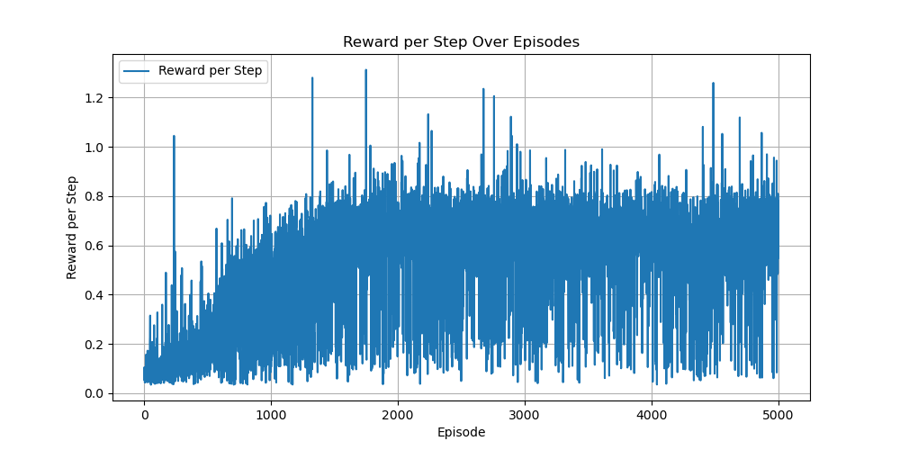
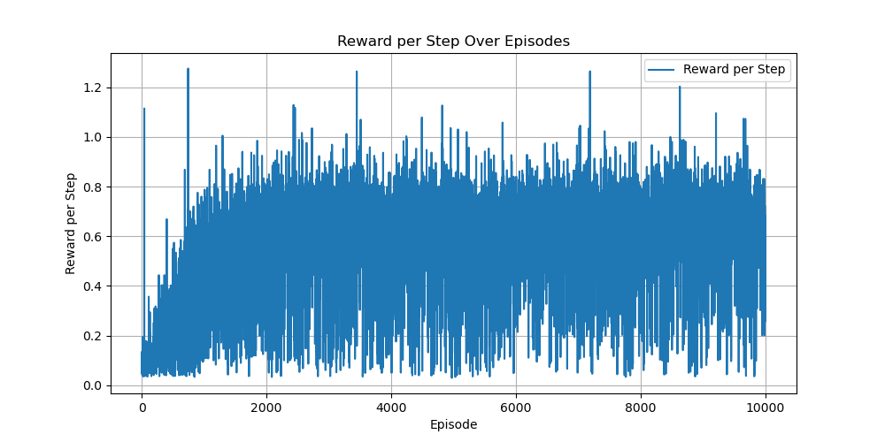
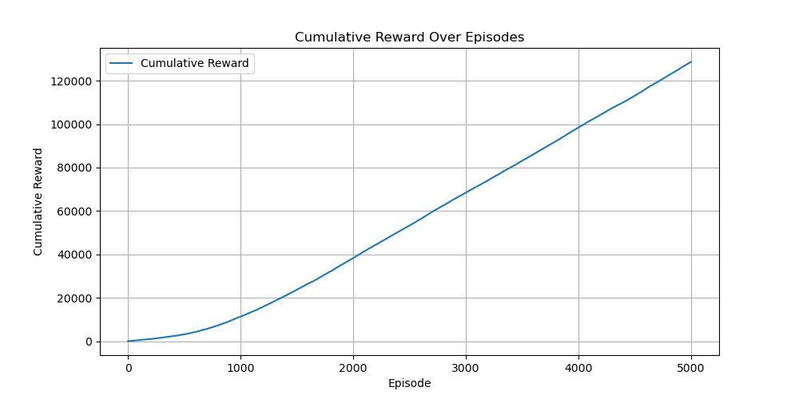
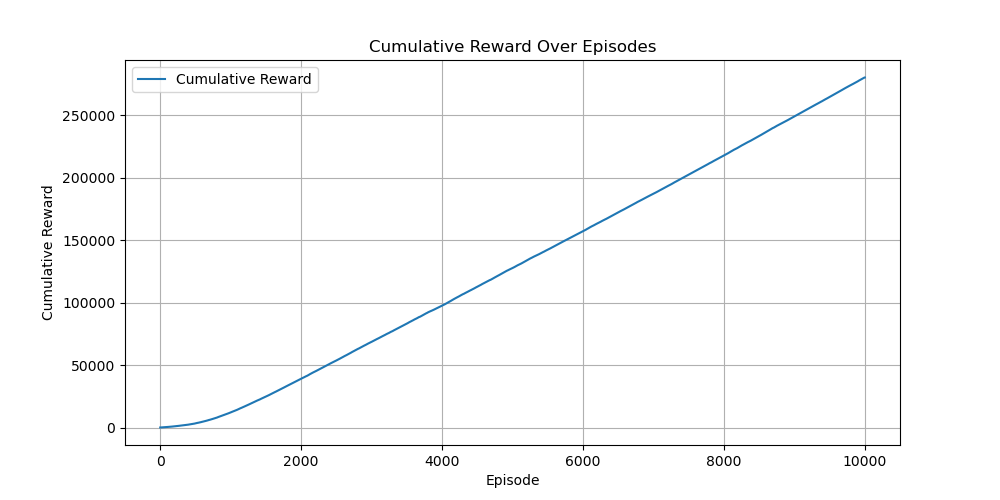

# CMPE591 - Homework 2

This repository contains code for training a Deep Q-Network (DQN) agent to control a robotic arm in a Mujoco simulation. The goal is for the arm to push the object to the final position.

## Project Structure

- **hw2.py**  
  Main script for training and testing the DQN agent.

  - **Training:**  
    Run with:
    ```bash
    python hw2.py
    ```
  - **Testing:**  
    Run with:
    ```bash
    python hw2.py --mode test
    ```

## Results Overview

After training, the RPS plots show that the agent’s performance improves over time. However, during testing it is observed that:

- The robotic arm reliably moves toward the object.
- The arm only sometimes pushes the object fully to the final position.

Second point may be caused by the agent might be optimizing for the immediate reward of end-effector proximity. Pushing the object to the goal might involve temporary loss of that easy reward, which the agent may avoid if it is not sufficiently incentivized, and therefore, it becomes stuck on the local optimum.

I have also trained it with a single hidden layer, used different hyperparameters, but none of them seem to fully converge well -such that the robotic arm reaches to the object AND pushes it towards the final position-.

### Plots

#### RPS Plot for 5000 Episodes



#### RPS Plot for 10000 Episodes



#### Cumulative Reward Plot for 5000 Episodes



#### Cumulative Reward Plot for 10000 Episodes



#### Reward History for 5000 Episodes

- **First 10 values:**  
  `First 10 values (5000 episodes): [2.78327173 5.27654286 2.83839558 3.17770791 3.76532047 2.20736781 5.30341393 2.67524068 4.39115611 3.06232361]`
- **Last 10 values:**  
  `Last 10 values (5000 episodes): [34.57982778 31.6591883  33.40401617 39.12768426 36.31400139 24.31494563 40.50106322 32.57841695 39.10078609 27.47111534]`

#### Reward History for 10000 Episodes

- **First 10 values:**  
  `First 10 values (10000 episodes): [3.4864814  5.49623716 2.85385751 3.31950198 2.37158823 6.80887599 5.48454947 5.88279848 2.05821267 3.75392634]`
- **Last 10 values:**  
  `Last 10 values (10000 episodes): [31.79293076 22.27942463 36.18354745 22.94748739 22.47712996 12.80264032 22.0743034  13.116206   10.85179652 34.06601635]`

```python
import numpy as np

# For 5000 episodes
reward_history_5000 = np.load('reward_history_5000_episodes.npy')
print("First 10 values (5000 episodes):", reward_history_5000[:10])
print("Last 10 values (5000 episodes):", reward_history_5000[-10:])

# For 10000 episodes
reward_history_10000 = np.load('reward_history_10000_episodes.npy')
print("First 10 values (10000 episodes):", reward_history_10000[:10])
print("Last 10 values (10000 episodes):", reward_history_10000[-10:])
```
